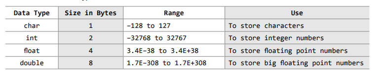
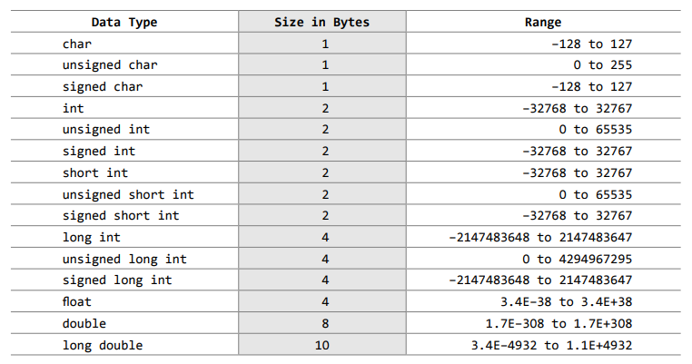
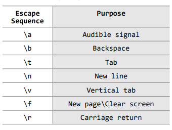

### Keywords in C
| ........  | ........  | ..........  | .......... | .........  | ..........  | .............  | .......... |
| --------  | --------  | ----------  | ---------  | ---------  | ----------  | -------------  | ---------- |
| auto      |  break    |   case      |   char     |   const    |  continue   |     default    |     do     |
| double    |  else     |   enum      |  extern    |  float     |  for        |     goto       |     if     |
| int       |  long     |   register  |  return    |  short     |  signed     |     sizeof     |     static |
| struct    |  switch   |   typedef   |  union     |  unsigned  |  void       |     volatile   |     while  |


### The four basic data types in C


### Data types variants
C supports modifiers--two sign specifiers(signed and unsigned) and two size specifiers(short and long)

Here are the basic data types variants in C


### Escape sequences in C


### Examples of standard header files in C
1. string.h --> for string handling operations
2. stdlib.h --> for some miscellaneous functions
3. stdio.h --> for standardized input and output functions
4. math.h --> for mathematical functions
5. alloc.h --> for dynamic memory allocation
6. conio.h --> for clearing the screen

### scanf
```scanf("control string", arg1, arg2, arg3, ..... argn)```
control string --> specifies format and type of data that has to be entered from the keyboard and stored in memory locations specified by the arguments after it.

### Find the large of the two numbers


### Flow control statements in C
