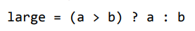
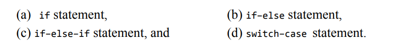

### Keywords in C
| ........  | ........  | ..........  | .......... | .........  | ..........  | .............  | .......... |
| --------  | --------  | ----------  | ---------  | ---------  | ----------  | -------------  | ---------- |
| auto      |  break    |   case      |   char     |   const    |  continue   |     default    |     do     |
| double    |  else     |   enum      |  extern    |  float     |  for        |     goto       |     if     |
| int       |  long     |   register  |  return    |  short     |  signed     |     sizeof     |     static |
| struct    |  switch   |   typedef   |  union     |  unsigned  |  void       |     volatile   |     while  |


### The four basic data types in C


### Data types variants
C supports modifiers--two sign specifiers(signed and unsigned) and two size specifiers(short and long)

Here are the basic data types variants in C


### Escape sequences in C


### Examples of standard header files in C
1. string.h --> for string handling operations
2. stdlib.h --> for some miscellaneous functions
3. stdio.h --> for standardized input and output functions
4. math.h --> for mathematical functions
5. alloc.h --> for dynamic memory allocation
6. conio.h --> for clearing the screen

### scanf
```scanf("control string", arg1, arg2, arg3, ..... argn)```
control string --> specifies format and type of data that has to be entered from the keyboard and stored in memory locations specified by the arguments after it.

### Find the large of the two numbers


### Flow control statements in C


### Functions
Function declaration --> declaration statement that identifies the function's name, list of arguments that it accepts and the type of data that it returns.  
Function definition --> consists of a function header that identifies the function, followed by the body of the function containing the executable code of the function. 

### Pointers
Dereferencing a pointer --> refering to the value stored in the location pointed by the pointer

### Data Structures
Common examples of data structures
- Arrays            
- Linked lists
- Queues            
- Stacks
- Binary trees      
- Hash tables

The term *data* means a value or a set of values. Specifies the value of a variable or a constant.  

Elementary data item --> data item that does not have subordinate items.

Group data item --> composed of one or more subordinate data items. For example: student's name may divided into three sub-items -- first, middle and last names -- but their roll number is treated as a single item.  

*Record* --> collection of data items. For example, name, address, contact, relationship, gender are all individual data items but may be grouped together into a record to represent a single contact record in a contact book.

*File* --> collection of related records. For example, if you have 60 contacts in your contact book, you have 60 records for all your contacts. All these related records are stored in a file.

*Primary Key* --> unique data item in a record that differentiates and identifies that record. Sort of an ID. 

### Primitive and non-primitive data structures
Primitive data structures are the fundamental data types that are natively supported by the programming language. They include:
1. Integer
2. Real
3. Character
4. Boolean

Non-primitive data structures are created using the primitive data structures. Categorized into *linear* and *non-linear*.

    - Linear data structures are stored in linear or sequential order. Include:
    1. Arrays
    2. Linked lists
    3. Stacks
    4. Queues

    Linear relationship can be achieved through sequential memory locations or by means of links.

    - Non-linear data structures are not stored in a sequential order. Adjacency is not maintained. Include *trees* and *graphs*.

### Operations on data structures
1. Traversing --> accessing each data item exactly once so that it can be processed. E.g., to print the names of all students in a class.
2. Searching --> find the location of one or more data items that meet a certain constraint. E.g., find the names of all students who scored 100 marks in Mathematics.
3. Inserting --> add new data items to the list of data items. E.g., add the details of a new student who joined the course.
4. Deletion --> remove an item from the collection of data items. E.g., remove the details of a student who just left the course.
5. Sorting --> arranging the data items in a cerain order, ascending or descending. E.g., arranging the names of students in aphabetical order.
6. Merging --> list of two sorted data items combined to form a single list of sorted items.